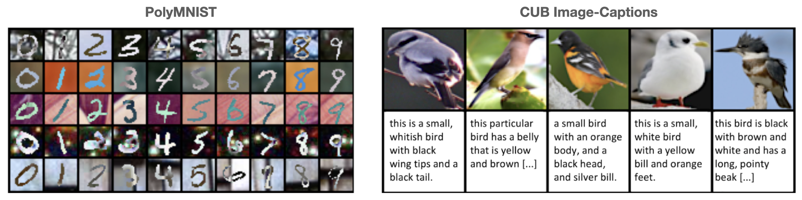

# MMVAE+: Enhancing the Generative Quality of Multimodal VAEs without Compromises

Official PyTorch implementation for MMVAE+, introduced in the paper [MMVAE+: Enhancing the Generative Quality of Multimodal VAEs without Compromises](https://openreview.net/pdf?id=sdQGxouELX), published at ICLR 2023.

**UPDATE: Jul 2024 new improved code release!**


## Download datasets 


```
mkdir data 
cd data 
curl -L -o data_ICLR_2.zip https://polybox.ethz.ch/index.php/s/wmAXzDAKn3Qogp7/download
unzip data_ICLR_2.zip 
curl -L -o cub.zip http://www.robots.ox.ac.uk/~yshi/mmdgm/datasets/cub.zip
unzip cub.zip
```

## Experiments 
Run on PolyMNIST dataset
```
bash commands/run_polyMNIST_experiment.sh
```
Run on CUB Image-Captions dataset
```
bash commands/run_CUB_experiment.sh
```

## Citing 
```
@inproceedings{
palumbo2023mmvaeplus,
title={{MMVAE}+: Enhancing the Generative Quality of Multimodal {VAE}s without Compromises},
author={Emanuele Palumbo and Imant Daunhawer and Julia E Vogt},
booktitle={International Conference on Learning Representations },
year={2023},
}
```

#### Acknowledgements
We thank the authors of the [MMVAE](https://github.com/iffsid/mmvae) repo, from which our codebase is based, and from which we retrieve the link to the CUB Image-Captions dataset.
We also thank he authors of the [MoPoE](https://github.com/thomassutter/MoPoE) for useful code.

